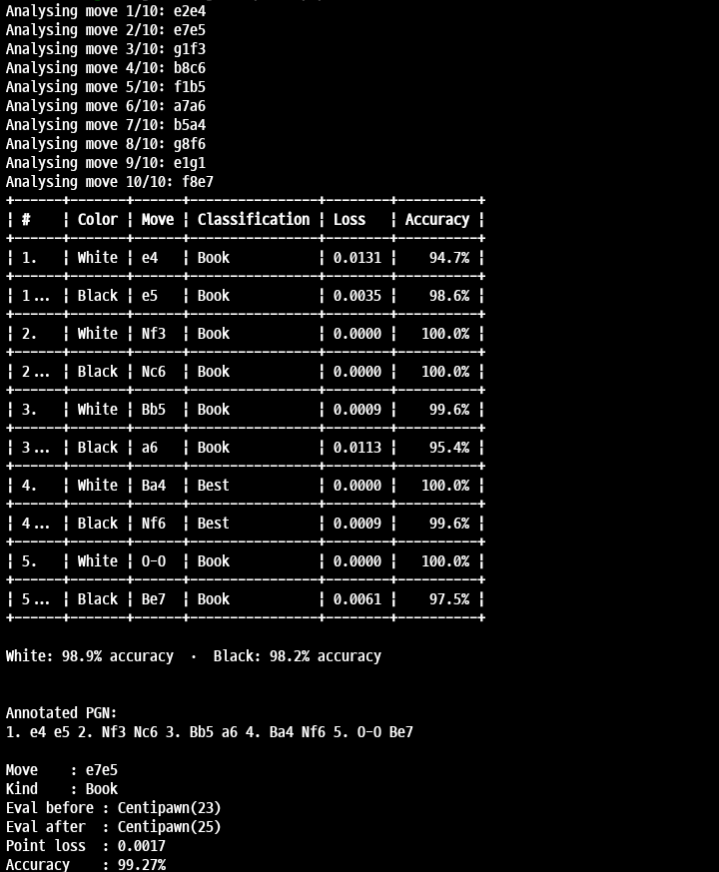

<div align="center">
  
  <h1>LazyChess</h1>
  <p>A fast, memory-efficient chess engine library for Rust.</p>

  [](https://crates.io/crates/lazychess)
  [](https://docs.rs/lazychess)
  [](LICENSE)
  [](https://github.com/OhMyDitzzy/LazyChess/actions/workflows/ci.yml)
  
</div>

---

LazyChess implements the full FIDE ruleset — castling, en passant, pawn promotion, and every draw condition — along with FEN/PGN serialisation, opening detection, and UCI engine communication.

> [!NOTE]
> LazyChess is still in its early stages of development. Your feedback and suggestions are very helpful for this library! Don't hesitate to visit the issues page if you have any problems with LazyChess!

## Installation

```toml
[dependencies]
lazychess = "0.1"
```

## Quick Start

```rust
use lazychess::Game;

fn main() {
    let mut game = Game::new();

    let moves = ["e2e4", "e7e5", "g1f3", "b8c6", "f1b5"];
    for mv in &moves {
        game.do_move(mv).expect("move should be legal");
    }

    println!("{}", game.display_board());
    println!("Opening : {:?}", game.opening_name());
    println!("Status  : {}", game.get_game_status_str());
    println!("FEN     : {}", game.get_fen());
    println!("PGN     : {}", game.get_pgn());
}
```

Output:
```
   +------------------------+
 8 | r  .  b  q  k  b  n  r |
 7 | p  p  p  p  .  p  p  p |
 6 | .  .  n  .  .  .  .  . |
 5 | .  B  .  .  p  .  .  . |
 4 | .  .  .  .  P  .  .  . |
 3 | .  .  .  .  .  N  .  . |
 2 | P  P  P  P  .  P  P  P |
 1 | R  N  B  Q  K  .  .  R |
   +------------------------+
     a  b  c  d  e  f  g  h

Opening : Some("Ruy Lopez")
Status  : ongoing
FEN     : r1bqkbnr/pppp1ppp/2n5/1B2p3/4P3/5N2/PPPP1PPP/RNBQK2R b KQkq - 3 3
PGN     : 1. e4 e5 2. Nf3 Nc6 3. Bb5 *
```

## Features

- [x] **Full FIDE rules**: all piece types, castling, en passant, promotion
- [x] **Draw detection**: 50-move rule, threefold repetition, insufficient material
- [x] **Notation**: FEN & PGN import/export, SAN generation, UCI move format
- [x] **Opening book**: built-in ECO table, load your own `openings.json` at runtime
- [x] **UCI**: spawn and communicate with any UCI-compatible engine (Stockfish, etc.)
- [x] **Undo**: full move history stack
- [x] **Analysis**: Move classification with accuracy scoring

## Examples

More complete examples are available in the [`examples/`](examples/) folder:

| Example | Description |
|---|---|
| `basic` | New game, make moves, display board, undo |
| `board_inspection` | Access the board array and piece data |
| `fen_pgn` | FEN/PGN import and export |
| `game_status` | Checkmate, stalemate, and draw detection |
| `move_validation` | Legal move generation and validation |
| `uci_engine` | Connect to Stockfish, get best move, MultiPV analysis |
| `analysis` | Full game analysis with move classification |

```bash
cargo run --example basic
cargo run --example uci_engine -- /path/to/stockfish
cargo run --example analysis -- /path/to/stockfish
```

## Quick Documentation

### UCI

LazyChess communicates with external UCI-compatible engines (Stockfish, Lc0, etc.) through a dedicated background thread that reads the engine's stdout without blocking your application. This design choice comes from the nature of chess engines themselves — a serious analysis at depth 20+ can take several seconds, and blocking the main thread (or an async executor) for that duration is impractical.

**Why a thread-based approach?**
- **Dedicated resources**: Each engine instance gets its own OS thread for stdout reading, ensuring lines are never dropped or delayed by other work happening in your program.
- **No async dependency**: You don't need Tokio or any async runtime. LazyChess works in synchronous codebases, CLI tools, game servers, or anywhere else without pulling in a heavy runtime.
- **Backpressure-free**: The reader thread buffers lines in an `mpsc` channel. Your code reads from the channel at its own pace — there's no risk of the engine's output blocking the engine process itself.

> [!NOTE]
> This is an experimental feature. Any errors or bugs may occur. Your suggestions will help us improve!

#### Quick Start

Spawn an engine, make a move, and ask for the best reply:

```rust
use lazychess::{
    uci::{SearchConfig, UciEngine},
    Game,
};

fn main() {
    let engine_path = std::env::args()
        .nth(1)
        .unwrap_or_else(|| "stockfish".to_string());

    println!("Spawning engine: {engine_path}\n");

    // Spawn the engine process and perform the UCI handshake.
    // with_options() lets you set engine parameters upfront.
    let mut engine = UciEngine::with_options(&engine_path, &[("Threads", "4"), ("Hash", "128")])
        .unwrap_or_else(|e| {
            eprintln!("Failed to start engine: {e}");
            eprintln!("Make sure Stockfish (or another UCI engine) is installed.");
            eprintln!("Usage: cargo run -- /path/to/engine");
            std::process::exit(1);
        });

    // Engine metadata is populated during the UCI handshake.
    if let Some(name) = &engine.info.name {
        println!("Engine : {name}");
    }
    if let Some(author) = &engine.info.author {
        println!("Author : {author}");
    }
    println!();

    let mut game = Game::new();

    // White plays 1. e4
    game.do_move("e2e4").unwrap();
    println!("{}", game.display_board());

    // Ask the engine for Black's best reply at depth 14.
    // Higher depth = stronger but slower.
    let config = SearchConfig::depth(14);
    let result = engine
        .play(&game, &config)
        .expect("play() failed");

    println!("Engine plays : {}", result.best_move);

    // Apply the engine's move to advance the game state.
    game.do_move(&result.best_move).unwrap();
    println!("{}", game.display_board());
}
```

Output:
```
Spawning engine: stockfish

Engine : Stockfish 18
Author : the Stockfish developers (see AUTHORS file)

   +------------------------+
 8 | r  n  b  q  k  b  n  r |
 7 | p  p  p  p  p  p  p  p |
 6 | .  .  .  .  .  .  .  . |
 5 | .  .  .  .  .  .  .  . |
 4 | .  .  .  .  P  .  .  . |
 3 | .  .  .  .  .  .  .  . |
 2 | P  P  P  P  .  P  P  P |
 1 | R  N  B  Q  K  B  N  R |
   +------------------------+
     a  b  c  d  e  f  g  h

Engine plays : e7e5

   +------------------------+
 8 | r  n  b  q  k  b  n  r |
 7 | p  p  p  p  .  p  p  p |
 6 | .  .  .  .  .  .  .  . |
 5 | .  .  .  .  p  .  .  . |
 4 | .  .  .  .  P  .  .  . |
 3 | .  .  .  .  .  .  .  . |
 2 | P  P  P  P  .  P  P  P |
 1 | R  N  B  Q  K  B  N  R |
   +------------------------+
     a  b  c  d  e  f  g  h
```

#### Pondering

Pondering lets the engine think in the background while waiting for the opponent's reply. `play()` returns both the engine's chosen move and its suggested ponder move extracted directly from the `bestmove e2e4 ponder e7e5` response — you never have to hardcode which move to ponder.

```rust
use lazychess::{
    uci::{SearchConfig, UciEngine},
    Game,
};

fn main() {
    let mut engine = UciEngine::with_options(
        "stockfish",
        &[("Threads", "2"), ("Hash", "64"), ("Ponder", "true")],
    )
    .expect("failed to start engine");

    engine.new_game().expect("ucinewgame failed");

    let mut game = Game::new();
    let config = SearchConfig::depth(14);

    // Engine plays and returns its ponder suggestion
    let result = engine.play(&game, &config).expect("play() failed");
    println!("Engine plays : {}", result.best_move);

    game.do_move(&result.best_move).unwrap();

    // Start background thinking on the expected opponent reply
    if let Some(ref ponder_mv) = result.ponder_move {
        println!("Pondering    : {ponder_mv}");
        engine.sync_game(&game).unwrap();
        engine.ponder(ponder_mv, &config).unwrap();
    }

    // Opponent plays — if they played the ponder move, call ponderhit()
    // to get the engine's reply instantly using the warm hash table
    if let Some(ref ponder_mv) = result.ponder_move {
        game.do_move(ponder_mv).unwrap();
        let hit = engine.ponderhit().expect("ponderhit failed");
        println!("Engine reply : {}", hit.best_move);
        game.do_move(&hit.best_move).unwrap();
    }

    println!("{}", game.display_board());
    engine.quit().unwrap();
}
```

If the opponent plays a **different** move than expected, call `ponder_miss()` to abort the background search, then call `play()` again for a fresh search:

```rust
engine.ponder_miss().unwrap();
game.do_move("c7c5").unwrap(); // actual opponent move

let result = engine.play(&game, &config).expect("fresh search failed");
println!("Engine reply : {}", result.best_move);
```

#### Timeout

LazyChess enforces a read timeout on every blocking call to the engine to guard against hangs — for example if the engine crashes silently, takes unexpectedly long at a high depth, or is left in infinite search mode by mistake.

| Scope | Default | How to change |
|---|---|---|
| Engine-level (all operations) | 10 000 ms | `engine.set_timeout(ms)` |
| Per-search override | inherited | `SearchConfig::builder().read_timeout_ms(ms)` |
| Analyzer per-move | 60 000 ms | `AnalyzerConfig::depth(n).with_timeout(ms)` |

```rust
// Raise the engine-level timeout globally (affects handshake, isready, etc.)
engine.set_timeout(30_000); // 30 seconds

// Override for one deep search only — does not affect the engine default.
let config = SearchConfig::builder()
    .depth(25)
    .read_timeout_ms(120_000) // 2 minutes for this search
    .build();

// Disable timeout entirely — useful during development or on slow hardware.
engine.set_timeout(u64::MAX);
```

When the timeout is reached, the operation returns `Err(UciError::Timeout)` with the message: **Engine did not respond in time**.

---

### Move Analysis

> [!NOTE]
> This feature is experimental. Classification results may not be perfectly accurate in all positions. Feedback and bug reports are very welcome!

`MoveAnalyzer` analyses every move in a game by asking the UCI engine to evaluate positions before and after each move, then comparing those evaluations to determine how good or bad the move was. The result is a human-readable classification familiar from platforms like Chess.com and Lichess.

#### Classification Types

| Classification | Symbol | Meaning |
|---|---|---|
| `Brilliant` | `!!` | An outstanding move, often a surprising sacrifice |
| `Great` | `!` | A strong move that is hard to find |
| `Best` | | The objectively top engine move |
| `Excellent` | | Very close to best with minimal loss |
| `Good` | | A solid move with small inaccuracy |
| `Okay` | | Playable but slightly imprecise |
| `Inaccuracy` | `?!` | A noticeable mistake that gives up some advantage |
| `Miss` | `?` | A missed opportunity — a much better move was available |
| `Mistake` | `?` | A significant error that worsens the position |
| `Blunder` | `??` | A serious error, often losing material or the game |
| `Forced` | | Only one legal move was available |
| `Book` | | A known opening theory move |
| `Risky` | `!?` | Objectively fine but leads to sharp, dangerous play |

#### Usage

```rust
use lazychess::{
    analyzer::{AnalyzerConfig, MoveAnalyzer},
    uci::UciEngine,
    Game,
};

fn main() {
    let mut engine = UciEngine::with_options("stockfish", &[("Threads", "4"), ("Hash", "128")])
        .expect("failed to start engine");

    // Analyse at depth 16 with a 60-second timeout per move (default).
    // Use .with_timeout(ms) to override if you need deeper searches.
    let config = AnalyzerConfig::depth(16).with_timeout(u64::MAX);
    let mut analyzer = MoveAnalyzer::new(&mut engine, config);

    let pgn = "1. e4 e5 2. Nf3 Nc6 3. Bb5 a6 4. Ba4 Nf6 5. O-O Be7";

    let report = analyzer
        .analyze_pgn(pgn)
        .on_progress(|cur, tot, mv| println!("Analysing move {cur}/{tot}: {mv}"))
        .run()
        .expect("analysis failed");

    // Formatted table (per-move breakdown)
    println!("{}", report.to_table());

    // Annotated PGN 
    // Symbols like !!, !, ?!, ?, ?? are inserted after each move.
    println!("\nAnnotated PGN:\n{}", report.to_pgn());

    // Classify a single move in real time
    // Useful for live game analysis without re-analysing the full game.
    let mut game = Game::new();
    game.do_move("e2e4").unwrap();

    let mc = analyzer.classify_move(&game, "e7e5").unwrap();
    println!("\nMove    : e7e5");
    println!("Kind    : {}", mc.kind);
    println!("Eval before : {:?}", mc.eval_before);
    println!("Eval after  : {:?}", mc.eval_after);
    println!("Point loss  : {:.4}", mc.point_loss);
    println!("Accuracy    : {:.2}%", mc.accuracy);
}
```

Output:



#### Filtering and Options

The builder returned by `analyze_pgn()` supports additional options:

```rust
use lazychess::analyzer::Side;

// Analyse only White's moves
let report = analyzer
    .analyze_pgn(pgn)
    .side(Side::White)
    .run()?;

// Only include moves classified as Inaccuracy or worse
use lazychess::classifications::types::ClassificationKind;
let report = analyzer
    .analyze_pgn(pgn)
    .min_classification(ClassificationKind::Inaccuracy)
    .run()?;
```

#### Timeout for Deep Analysis

The default 60-second timeout per move is sufficient for most depths. For very deep searches (depth 22+) or slow hardware, raise it:

```rust
// 2 minutes per move
let config = AnalyzerConfig::depth(22).with_timeout(120_000);
```

---

## License

MIT License

Copyright (c) 2026 Ditzzy LazyChess Authors  
Copyright (c) 2026 LazyChess Contributors

Permission is hereby granted, free of charge, to any person obtaining a copy
of this software and associated documentation files (the "Software"), to deal
in the Software without restriction, including without limitation the rights
to use, copy, modify, merge, publish, distribute, sublicense, and/or sell
copies of the Software, and to permit persons to whom the Software is
furnished to do so, subject to the following conditions:

The above copyright notice and this permission notice shall be included in all
copies or substantial portions of the Software.

THE SOFTWARE IS PROVIDED "AS IS", WITHOUT WARRANTY OF ANY KIND, EXPRESS OR
IMPLIED, INCLUDING BUT NOT LIMITED TO THE WARRANTIES OF MERCHANTABILITY,
FITNESS FOR A PARTICULAR PURPOSE AND NONINFRINGEMENT. IN NO EVENT SHALL THE
AUTHORS OR COPYRIGHT HOLDERS BE LIABLE FOR ANY CLAIM, DAMAGES OR OTHER
LIABILITY, WHETHER IN AN ACTION OF CONTRACT, TORT OR OTHERWISE, ARISING FROM,
OUT OF OR IN CONNECTION WITH THE SOFTWARE OR THE USE OR OTHER DEALINGS IN THE
SOFTWARE.